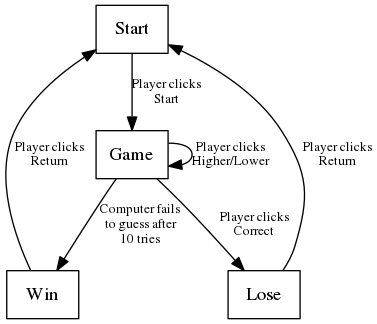
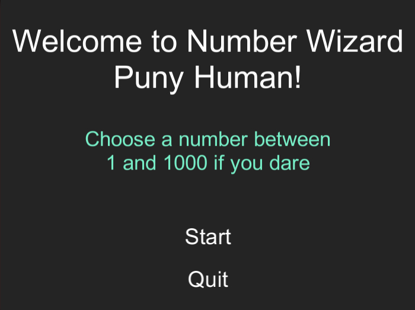
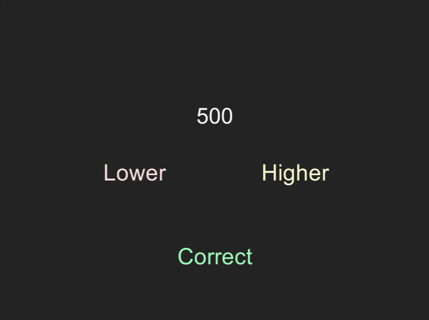
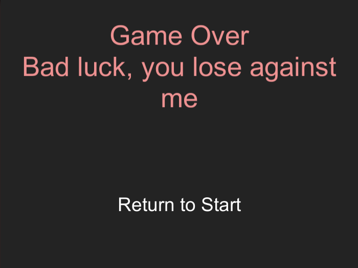

# NumberWizard

##Description

The player selects an number between 1 and 1000, and the game will ask if it's higher of lower than the number displayed.
If the game displays the same number, the player lose. 
If the game doesn't display the number in 10 tries, the player win.

##Tecnologies used
- Unity 5.3.1
- MonoDevelop 5.9.6

##Algorithms

##Scenes

###Start

###Game

###Win

###Lose

